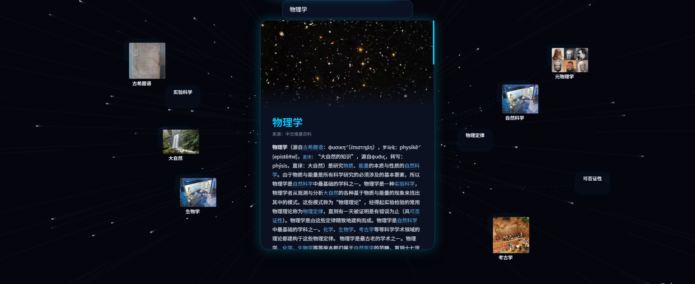
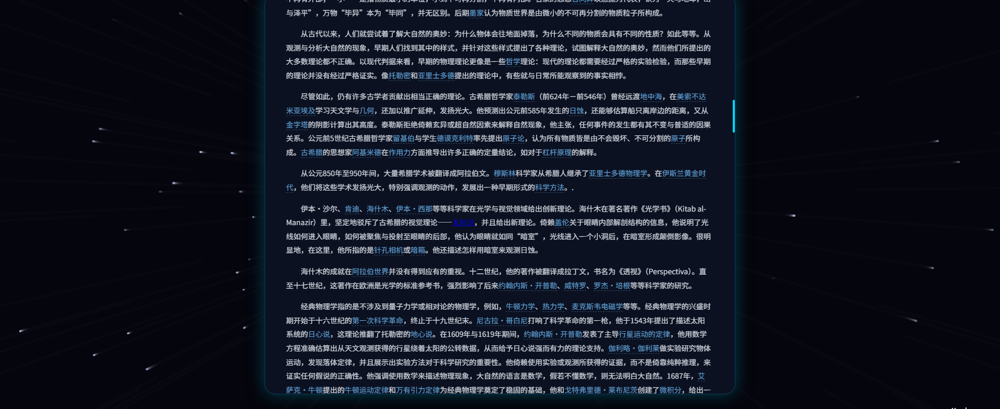

# 🌌 3D ZIM Explorer — 时空导航

<p align="center">
  <strong>在星空中探索知识 — 维基百科 3D 可视化知识图谱</strong>
</p>

<p align="center">
  <a href="#-预览">预览</a> •
  <a href="#-核心特性">特性</a> •
  <a href="#-快速开始">快速开始</a> •
  <a href="#-技术栈">技术栈</a> •
  <a href="#english">English</a>
</p>

<p align="center">
  
</p>

---

## 🖼️ 预览

### 🌠 3D 知识星图

搜索任意词条，即刻展开璀璨的知识星空。中心卡片展示当前词条，周围环绕着关联知识节点，弧线勾勒出概念之间的内在联系。

<p align="center">
  
</p>

### 📄 词条详情与公式渲染

点击节点或展开全文，查看完整词条内容。LaTeX 数学公式自动渲染，维基超链接保持可交互。

<p align="center">
  
</p>

> 💡 **时空穿梭**：点击任意关联节点，星空化作光流拉丝，如同穿越虫洞般进入新的知识领域。

---

## ✨ 核心特性

| 特性 | 说明 |
|------|------|
| 🌠 **3D 知识星图** | 中心词条卡片 + 环绕关联节点（带缩略图）+ 弧形连线 |
| 🚀 **时空穿梭动画** | 点击跳转时星空加速拉丝，沉浸式虫洞穿越体验 |
| 🔢 **LaTeX 数学公式** | KaTeX 渲染，支持 `$$`、`\[...\]`、`\(...\)`、`{\displaystyle}` 等 |
| 🔗 **维基超链接** | 正文内链接可点击跳转，无缝衔接星图探索 |
| 🧭 **导航面包屑** | 追踪浏览路径，随时回溯历史节点 |
| 🌐 **多语言界面** | 简体中文 / 繁体中文 / English 一键切换 |
| 💡 **思路导出** | 将浏览路径导出为 Markdown 结构化笔记 |
| 📦 **完全离线** | 基于 ZIM 文件运行，无需互联网连接 |

---

## 🚀 快速开始

### 环境要求

- Python 3.10+
- [Kiwix Wikipedia ZIM 文件](https://wiki.kiwix.org/wiki/Content)（中文推荐 `wikipedia_zh_all_maxi_*.zim`）

### 安装 & 启动（三步）

```bash
# 1. 克隆项目
git clone https://github.com/556000/3d-zim-explorer.git
cd 3d-zim-explorer

# 2. 安装依赖
pip install fastapi uvicorn libzim beautifulsoup4 zhconv

# 3. 配置 ZIM 文件路径
# 编辑 zim-config.json，填入你的 ZIM 文件路径

# 4. 启动
python server.py
# 浏览器打开 http://localhost:8765
```

> 💡 Windows 用户可直接双击 `启动.bat` 一键启动。

### 操作指南

| 操作 | 效果 |
|------|------|
| 🔍 搜索 + 回车 | 搜索词条并展开知识星图 |
| 👆 单击节点 | 查看词条摘要和关联内容 |
| 👆👆 双击节点 | 以该词条为中心重新布局星图 |
| 🖱️ 鼠标拖拽 | 旋转 3D 视角 |
| 🔄 滚轮 | 缩放 |
| ➡️ 右键拖拽 | 平移视角 |

---

## 🛠️ 技术栈

| 层级 | 技术 |
|------|------|
| **后端** | FastAPI + libzim + BeautifulSoup4 + zhconv |
| **3D 引擎** | Three.js (Canvas 星空背景) |
| **前端** | 原生 HTML/CSS/JS（无框架依赖） |
| **数学渲染** | KaTeX |
| **数据源** | ZIM 离线维基百科（来自 [Kiwix](https://kiwix.org/)） |

```
3d-wiki-explorer/
├── server.py           # FastAPI 后端（ZIM 解析 + API）
├── index.html          # 单文件前端（HTML/CSS/JS 全合一）
├── three.min.js        # Three.js 3D 引擎
├── OrbitControls.js    # 相机控制
├── zim-config.json     # ZIM 文件路径配置
├── 启动.bat             # Windows 一键启动
└── start.bat           # Windows 仅启动服务
```

---

## 📋 更新日志

### v0.951 (2026-04-22)

- 🔧 **修复 renderMath 链路丢失**：TOKEN 占位符机制，KaTeX 不再破坏 `.wiki-link` DOM
- ⚡ **物理引擎重构**：空间哈希网格 O(n) 碰撞检测，能量阈值提前终止
- 🧹 **内存管理完善**：缩略图请求 stale 检测 + one-shot 回调防 DOM 泄漏
- 🎨 **动态连线**：SVG 路径池每帧仅更新 `d` 属性，零 DOM 删建
- 🪟 **响应式布局**：resize 时 lerp 平滑过渡，无位置跳变

### v0.95 (2026-04-22)

- 🎉 初始发布：3D 知识星图 + 时空穿梭动画 + KaTeX 公式 + 多语言 + 面包屑导航 + 思路导出

---

## 📜 协议

[GNU GPL v3.0](LICENSE) · 使用 [libzim](https://github.com/openzim/libzim) 库 · 致谢 [Kiwix](https://kiwix.org/)

## 👤 作者

**陈驰 (Xarker)** — 中国·贵州·凯里

📧 12097652@QQ.com · [GitHub](https://github.com/556000/3d-zim-explorer) · [Gitee](https://gitee.com/xarker/3d-zim-explorer)

---

*时空导航，点亮探索之路* ✨

---

## English

**3D ZIM Explorer** is a 3D interactive Wikipedia knowledge graph explorer with immersive star-map visualization and warp-speed navigation animations.

<p align="center">
  
</p>

### Features

- 🌍 **3D Knowledge Graph** — Central article card + orbiting related nodes (with thumbnails) + arc connections
- 🚀 **Warp Animation** — Starfield stretches into light streams when jumping between articles
- 🔢 **KaTeX Math Rendering** — Full LaTeX support: `$$`, `\[\]`, `\(\)`, `{\displaystyle}`
- 🔗 **Clickable Wiki Links** — In-article links trigger seamless star-map transitions
- 🧭 **Breadcrumb Navigation** — Track and revisit your exploration path
- 🌐 **Multi-language UI** — Simplified Chinese / Traditional Chinese / English
- 💡 **Mind Export** — Export browsing history as structured Markdown notes
- 📦 **Offline-first** — Runs entirely on local ZIM files, no internet needed

### Quick Start

```bash
git clone https://github.com/556000/3d-zim-explorer.git
cd 3d-zim-explorer
pip install fastapi uvicorn libzim beautifulsoup4 zhconv
# Edit zim-config.json with your ZIM file path
python server.py
# Open http://localhost:8765
```
